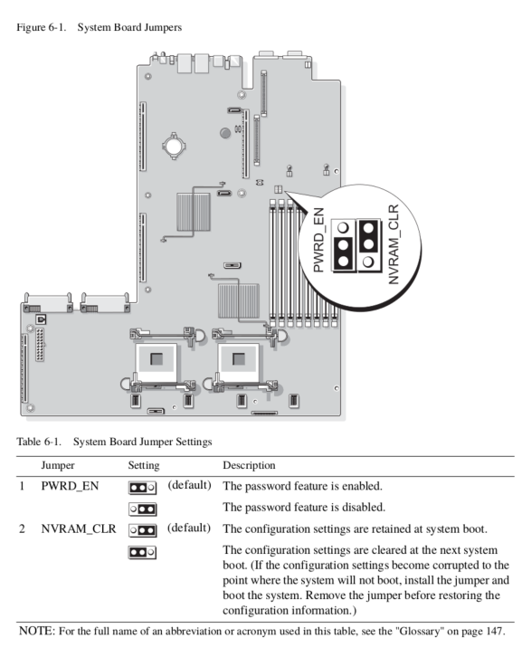

# Using Graphics Cards

The Poweredge 1950 was produced in an era before GPGPU computing was in vogue
and was not built with high-power use PCIe devices in mind. However, with enough
work GPUs *can* be used

### PCIe Slots Available

The Poweredge 1950 can be equipped with either two PCI-X risers, or two PCIe 2.0
8x risers. Note that these *cannot* be mixed and matched, it must be either two
PCI-X risers, or two PCIe risers.

Since there are a very limited number of PCI-X graphics cards available, none of
which are any good, for GPU use the two PCIe risers will are almost always used.

### Caveats

The PCIe 2.0 standard dictates that PCIe slots should provide 25 watts of power to
standard devices and up to 75 watts to devices identified as "high power" such as
graphics cards. However, it seems that the 8x PCIe slots do *not* comply with
this part of the standard and will only supply up to 25 watts to any device.

### Using a Graphics Card as a VGA Device

In order to use graphics cards as VGA devices, which
is required for graphics output and OpenCL/CUDA device use, the iDRAC
remote management card will need to be removed. In general the system will boot
just fine with the iDRAC in place, but any attached graphics cards will not show
up as valid VGA devices on boot. By removing the iDRAC and resetting the BIOS
graphics cards can be used as VGA devices, as per usual.

### Using Graphics Cards that Require <= 25 Watts

Graphics cards that draw less than 25 watts will, generally not run afoul
of power draw issues. However not every card will be recognized by the BIOS, and
there doesn't appear to be any way to tell *a prior* which cards will work.

### Using Graphics Cards that Require > 25 Watts

Any card that is rated at > 75 watt power usage will generally cause a POST failure
with an PCIe riser error, assuming only power from the PCIe slot is used. However,
if 12 volt power is supplied from an external source the card will usually work
as intended. As a word of caution a power supplied to the card should always use
the same ground reference. That is, using the 12 volt power from the PCIe rail
and auxiliary power from an external power supply is *not recommended*.
Power should either be supplied from the 12 volt sources available on the main board
( or the two power supplies ) or entirely from an external power supplies, as is the
case when using a PCIe extender and external power supply.

### Resetting the BIOS

Any time the iDRAC card is removed from or added to the system the BIOS will need
to be reset or the system will hang on POST. The order to reset the BIOS the
`NVRAM_CLR` jumper will need to be set to the "clear" position and the system will
need to be boot cycled.

A page from the maintenance manual for setting the `NVRAM_CLR` jumper is shown below.

### List of Graphics Cards Known to Work

* PNY GeForce GT 720 1GB DDR3
* Sapphire Nitro Radeon R7 360

### List of Graphics Cards Known NOT to Work

* Nvidia GeForce GTX 750 Ti
